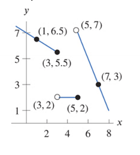
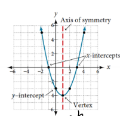

Chapters 1, 2, 3
============================

Rates of change
---------------------------------------------

.. rubric:: Information

| 
| Rates of change is how much a function increases over a period of time.
| 
| Liner functions always have constant rate of change
| Can be described as :math:`\frac{rise}{run}`

.. rubric:: Calculating between points

.. math::

    \frac{rise}{run} = \frac{y_{1} - y_{2}}{x_{1} - x_{2}}

Input / Output and Domain and Range
-----------------------------------------

| A **function** is a where an input collates to an output. One input must have only one output. Often written in f(x) where x is the input and f(x) is the output.
| The **domain** of a function are all valid input values.
| The **range** of a function are all reachable outputs.

.. note:: 

    When a variable is stated to be a function of another variable it is the output. For example cost is a function of price would mean :math:`cost = f(price)`

.. rubric:: Evaluating functions

Just plug in the values.

.. math::

    f(x) &= 8x + 2 \\
    f(7) &= 8 \cdot 7 + 2 \\ 
    f(7) &= 58

.. rubric:: Testing functions by table

A function can only have one input per output.

.. list-table::
    :header-rows: 1

    * - x
      - y

    * - 1
      - 4

    * - 7
      - 2

    * - 1
      - 6

Not a function due to having two values for one.

.. rubric:: Testing functions on a graph

By utilizing the vertical line test we can is if its a function.

.. drawio-image:: images/not-a-function.drawio

.. rubric:: Finding dormain Examples

.. math::

  f(x) = \sqrt{x-5}

By seeing that anything below 5 will make this invalid we can say the domain is :math:`x \ge 5`

.. math::

  f(x) = \frac{1}{x-5}

By seeing that 5 results in a divison by zero: :math:`x \neq 5`

.. math::

  f(x) = \frac{1}{\sqrt{x-5}}

By seeing that anything below 5 will make this invalid and by seeing that 5 results in a divison by zero: :math:`x > 5`

Piecewise
-----------------------------------------

| A **piecewise** function uses a diffrent forumular for diffrent dormain.

.. math::

  &= -\frac{1}{2} x + 7 \qquad x \le 3 \\
  &= 2 \qquad 3 < x \le 2 \\
  &= -2x + 17 \qquad x > 5 

Absolute Value
--------------------

Parent function: :math:`|x|`

Can also be express as 

.. math::

  &= x \qquad x \ge 0 \\
  &= -x \qquad x < 0 

| Dormain: All real numbers
| Range: :math:`x \ge 0`
| Reflected: :math:`-|x|`
| Shift right: :math:`|x - 1|`
| Shift up: :math:`|x| + 1`

.. rubric:: Adding/Subtracting Absolute Value

.. math::

  y = |x+1| + |x-3|

1. Rough sketch

.. drawio-image:: images/av-sketch.drawio

2. Add equations in each regin. If line is going down, muliply by -1

.. math::

  y &= -x - 1 - x + 3 \qquad x \le -w \\
  y &= x + 1 - x + 3 \qquad -1 < x < 3 \\
  y &= x + 1 + x - 3 \qquad x \ge 3 \\

3. Simplfy

.. math::

  y &= -2x + 2 \qquad x \le -w \\
  y &= 4 \qquad -1 < x < 3 \\
  y &= 2x - 2 \qquad x \ge 3 \\

Inverse
------------

To find the inverse, solve for the opposite variable. 

.. math::

  y &= 10x + 4 \\
  y - 4 &= 10x \\
  x &= \frac{y - 4}{10}

If like f(x):

.. math::

  f(x) &= -2x \\
  \frac{y}{-2} &= x \\
  f^{-1}(x) = \frac{x}{-2}

Composite
------------

.. math::

  f(x) &= 10x + 1 \\
  g(x) &= 2x \\
  f(g(x)) &= 2x(10) + 1 \\
  f(g(x)) &= 20x + 1

Concavity
-----------

| Concave up - Like a cup shape; opens upward
| Concave down - Like a arc shape; opens downward
| Inflection point where the concavity changes

.. drawio-image:: images/concavity.drawio

Rate of change for cocave up is incressing

Quadratics
---------------

| A quaratic is any polynomial with a degree of two
| The vertex is ethier the min or max
| The axis of symmetry is a vertical line which goes though the middle

.. rubric:: Standard Form

.. math:: 

  f(x) = ax^2 + bx + c

.. rubric:: Factored Form

.. math:: 

  f(x) = a(x-r)(x-s)

x and r are zeros

.. rubric:: Vertex Form

.. math:: 

  f(x) = a(x-h)^2+k

| k - y cord of vertex
| h - x coprd of vertex

.. rubric:: Forumlar to find axis of symmetry

.. math::

  \frac{-b}{2a}

The number values must come from standard form

.. rubric:: Forumlar to find discriminant

.. math::

  b^2 - 4ac

The number values must come from standard form

If it is negative, no real solutions. If it is 0, one real solution. If it is positive, two real solutions.

.. rubric:: Quadratic Formula

.. math::

  \frac{-b \pm \sqrt{b^2 - 4ac}}{2a}

The number values must come from standard form.

This forumlar returns the zeros.

