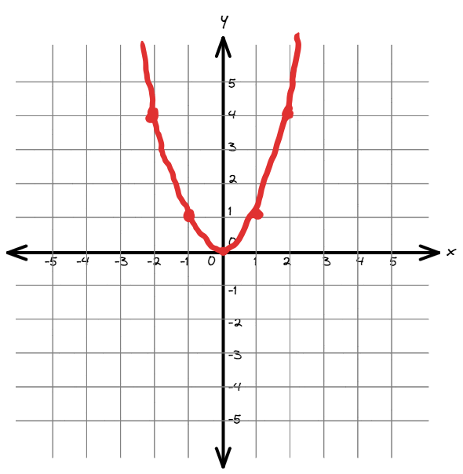

Transformations (Chapter 6)
============================

Parent Functions
---------------------------------------------

.. rubric:: Linear

Formula:

.. math::

    y = x

.. image:: images/basic-linear.png

.. math::

    \textnormal{Domain: } (-\infty, \infty)
    \textnormal{Range: } (-\infty, \infty)

.. rubric:: Square / Quadratic

Formula:

.. math::

    y = x^2

.. math::

    \textnormal{Domain: } (-\infty, \infty)
    \textnormal{Range: } (0, \infty)

.. rubric:: Square Root

Formula:

.. math::

    y = \sqrt(x)

.. image:: images/basic-sqrt.png

.. math::

    \textnormal{Domain: } (0, \infty)
    \textnormal{Range: } (0, \infty)

.. rubric:: Cubic

Formula:

.. math::

    y = x^3

.. image:: images/basic-cubic.excalidraw.png

.. math::

    \textnormal{Domain: } (-\infty, \infty)
    \textnormal{Range: } (-\infty, \infty)

.. rubric:: Cubic Root

Formula:

.. math::

    y = \sqrt[3]{x}

.. image:: images/basic-cubic-root.png

.. math::

    \textnormal{Domain: } (-\infty, \infty)
    \textnormal{Range: } (-\infty, \infty)

.. rubric:: Reciprocal

Formula:

.. math::

    y = \frac{1}{x}

.. image:: images/basic-reciprocal.png

.. math::

    \textnormal{Domain: } (-\infty, 0) U (0, \infty) 
    \textnormal{Range: } (-\infty, \infty)

.. rubric:: Absolute Value

Formula:

.. math::

    y = |x|

.. image:: images/basic-absolute-value.png

.. math::

    \textnormal{Domain: } (-\infty, \infty) 
    \textnormal{Range: } (0, \infty)

.. rubric:: Exponential

Formula:

.. math::

    y = e^x

.. image:: images/basic-exponential.png

.. math::

    \textnormal{Domain: } (-\infty, \infty) 
    \textnormal{Range: } (0, \infty)

.. rubric:: Basic Natural Log

Formula:

.. math::

    y = ln(x)

.. image:: images/basic-natural-log.png

.. math::

    \textnormal{Domain: } (0, \infty) 
    \textnormal{Range: } (-\infty, \infty)

