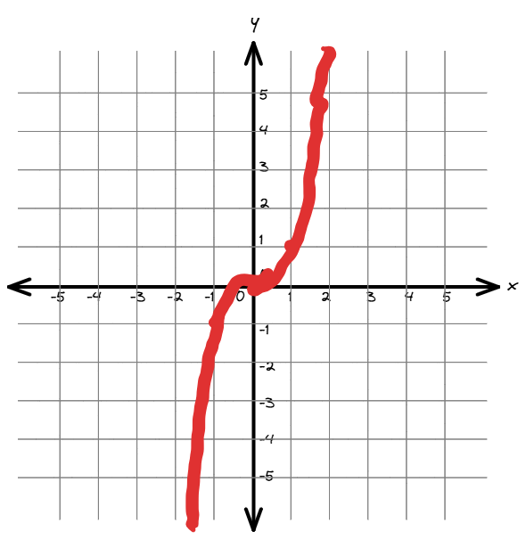
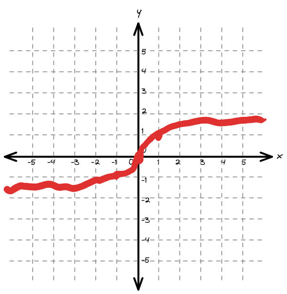
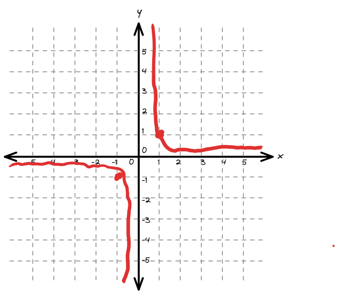
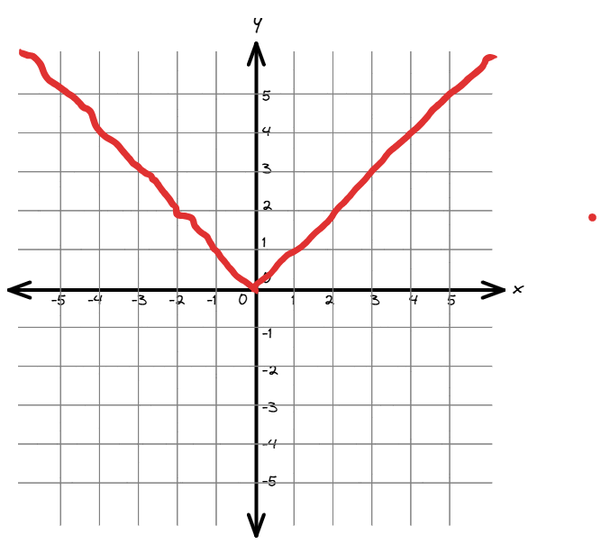
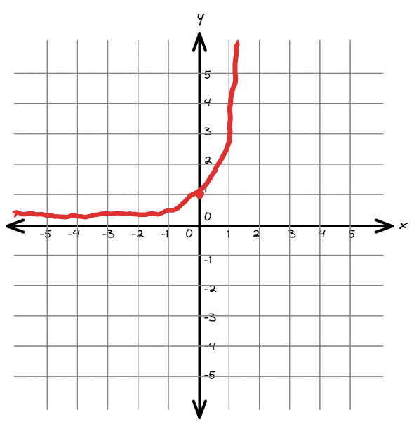
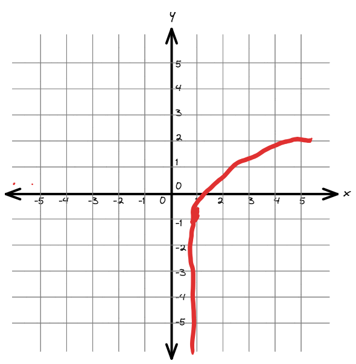
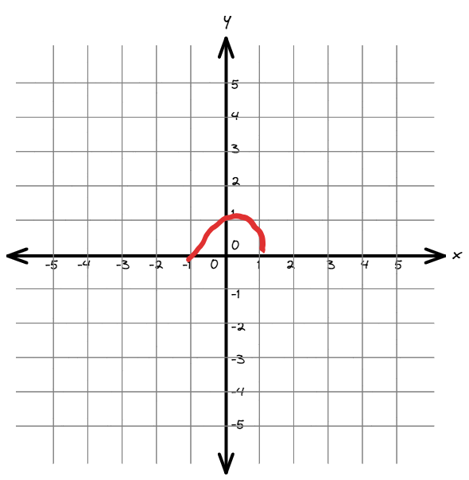
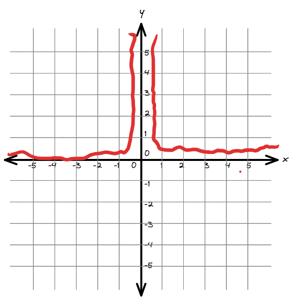
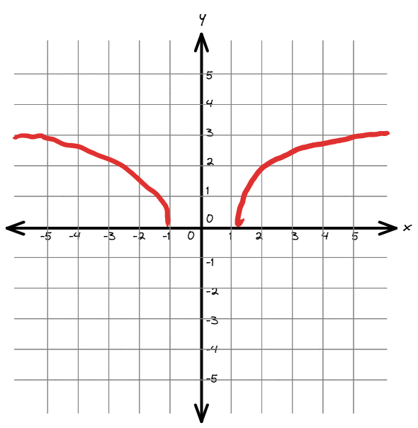
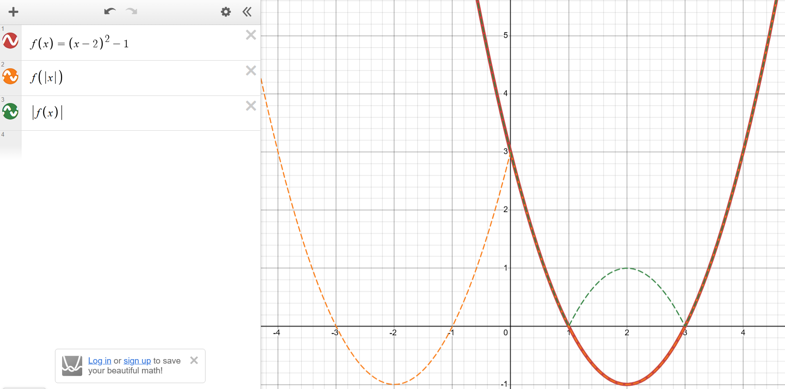

Transformations (Chapter 6)
============================

Parent Functions
---------------------------------------------

.. rubric:: Linear

Formula:

.. math::

    y = x

.. math::

    \textnormal{Domain: } (-\infty, \infty)
    \textnormal{Range: } (-\infty, \infty)

.. rubric:: Square / Quadratic

Formula:

.. math::

    y = x^2

.. math::

    \textnormal{Domain: } (-\infty, \infty)
    \textnormal{Range: } (0, \infty)

.. rubric:: Square Root

Formula:

.. math::

    y = \sqrt(x)

.. math::

    \textnormal{Domain: } (0, \infty)
    \textnormal{Range: } (0, \infty)

.. rubric:: Cubic

Formula:

.. math::

    y = x^3

.. math::

    \textnormal{Domain: } (-\infty, \infty)
    \textnormal{Range: } (-\infty, \infty)

.. rubric:: Cubic Root

Formula:

.. math::

    y = \sqrt[3]{x}

.. math::

    \textnormal{Domain: } (-\infty, \infty)
    \textnormal{Range: } (-\infty, \infty)

.. rubric:: Reciprocal

Formula:

.. math::

    y = \frac{1}{x}

.. math::

    \textnormal{Domain: } (-\infty, 0) U (0, \infty) 
    \textnormal{Range: } (-\infty, \infty)

.. rubric:: Absolute Value

Formula:

.. math::

    y = |x|

.. math::

    \textnormal{Domain: } (-\infty, \infty) 
    \textnormal{Range: } (0, \infty)

.. rubric:: Exponential

Formula:

.. math::

    y = e^x

.. math::

    \textnormal{Domain: } (-\infty, \infty) 
    \textnormal{Range: } (0, \infty)

.. rubric:: Basic Natural Log

Formula:

.. math::

    y = ln(x)

.. math::

    \textnormal{Domain: } (0, \infty) 
    \textnormal{Range: } (-\infty, \infty)

.. rubric:: Semicircle

Formula:

.. math::

    r^2 &= x^2 + y^2 \\
    y &= \sqrt(r^2-x^2) \\
    y &= \sqrt(a-x^2) \\
    y &= \sqrt(1-x^2)

.. math::

    \textnormal{Domain: } [-1, 1] 
    \textnormal{Range: } [0, 1]

.. rubric:: Square Reciprocal

Formula:

.. math::

    y = \frac{1}{x^2}

.. math::

    \textnormal{Domain: } (-\infty, 0) U (0, \infty) 
    \textnormal{Range: } (0, \infty]

.. rubric:: Semicircle

Formula:

.. math::

    r^2 &= x^2 + y^2 \\
    y &= \sqrt(r^2-x^2) \\
    y &= \sqrt(a-x^2) \\
    y &= \sqrt(1-x^2)

.. math::

    \textnormal{Domain: } [-1, 1] 
    \textnormal{Range: } [0, 1]

.. rubric:: Hyperbola

Formula:

.. math::

    c^2 &= x^2 - y^2 \\
    y &= \sqrt(x^2-c^2) \\
    y &= \sqrt(x^2-a)

.. math::

    \textnormal{Domain: } (-\infty, -1] U [1, \infty) 
    \textnormal{Range: } (0, \infty)

Shifts
-------------

| A **horizontal shift** is when the input of a function (x) is modified. This shifts the function to the left. For example :math:`f(x-3)` will shift the function 3 to the right. 
| A **vertical shift** is when the output of a function (y) is modified. This shifts the function up. For example :math:`f(x) + 3` will shift the function 3 up.

.. rubric:: Effects on Domain and Range

A horizontal shift will affect the domain while a vertical shift will affect the range.

.. rubric:: Example of horizontal shift

.. math::

    y = \frac{1}{(x-2)^2}

Shifts the function two to the right. Domain becomes :math:`(-\infty, 2) U (2, \infty) `

.. rubric:: Example of vertical shift

.. math::

    y = \frac{1}{x^2} + 2

Shifts the function two up. Range becomes :math:`(2, \infty) `

Reflections
-------------

| To reflect across the **x-axis** multiply the output by -l, example: :math:`-g(x)`
| To reflect across the **y-axis** multiply the input by -l, example: :math:`g(-x)`
| An **even function** can be reflected around the y-axis without changing.
| An **odd function** can be reflected around the origin without changing.

.. rubric:: Absolute Value

| To mirror quadrants i and iv into ii and iii (mirror across y), place the input in absolute value;
| To reflect quadrants iii and iv into i and ii (mirror across x), place the output in absolute value;

Even and odd
--------------

To find if function even or odd, plug in -x into the function.

| If is is an even function: :math:`f(-x) = f(x)`
| If is is an odd function: :math:`f(-x) = -f(x)`

Example of odd function (:math:`g(x) = \frac{1}{x}`):

.. math::

    g(-x) &= \frac{1}{-x} \\
    g(-x) &= - \frac{1}{x} \\  
    g(-x) &= -g(x)

Example of even (:math:`g(x) = x^2`):

.. math::

    g(-x) &= (-x)^2 \\
    g(-x) &= x^2 \\  
    g(-x) &= g(x)

Stretch and Compress
----------------------

| A **vertical stretch** results when the output of a function is multiplied by a factor greater than than one, for example :math:`a \cdot f(x)` when :math:`a > 1`.
| A **vertical compression** results when the output of a function is multiplied by a factor less than one, for example :math:`a \cdot f(x)` when :math:`0 < a < 1`.

| A **horizontal stretch** results when the input of a function is multiplied by a factor less than one, for example :math:`f(ax)` when :math:`0 < a < 1`.
| A **horizontal compression** results when the input of a function is multiplied by a factor greater than one, for example :math:`f(ax)` when :math:`a > 1`.

.. note::

    In vertical compression/stretch the function is stretch/compressed by a factor of :math:`\frac{1}{a}`

.. note::

    When a is negitive, use :math:`|a|` for stretching/compression

Order
-----------

Order maters!!!

#. Horizontal stretch or compression
#. Horizontal shift
#. :math:`(|x|)`
#. :math:`|f(x)|`
#. Vertical stretch or compression

.. rubric:: Example

.. math::

    -2 f(3x -2) + 2

#. Horizontal compress by a factor of :math:`\frac{1}{3}`
#. Shift left 2
#. Vertical stretch by factor of :math:`2`
#. Reflect across x axis
#. Shift up 2

