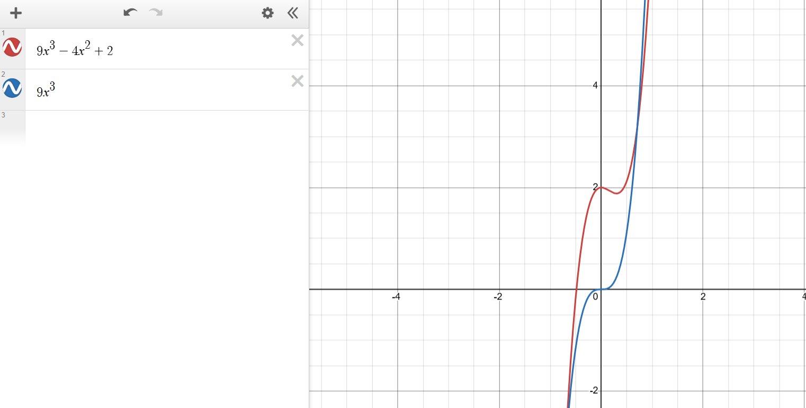

Polynomials and Power Functions (Chapter 11)
==================================================

Power Functions
----------------

.. rubric:: Power Function form

.. math::

    f(x) = kx^p

k and p are constants.

.. rubric:: Example of Power Function

.. math::

    f(x) = 2 \sqrt[3]{x}

p: :math:`\frac{1}{3}`
k: :math:`2`

.. rubric:: Example of Not a Power Function

.. math::

    f(x) = (x-2)^2

Not a power function due to multiple x values when expanded

.. rubric:: Direct and Inverse Proportional 

| If f(x) is directly proportional to :math:`x^p` if :math:`f(x) = kx^p`
| If f(x) is inverse proportional to :math:`x^p` if :math:`f(x) = \frac{k}{x^p}`

.. todo::

    Make some example questions

.. rubric:: Graphs of Power Functions

The graph is based off of the k an p. The following is based off p is a non negative integer.

.. drawio-image:: img3/power-functions-graph.drawio

Limit Notations
------------------

A limit is is what a function approaches as x approaches a.

.. math::

    \displaystyle{\lim_{x \to a}} f(x)

For example:

.. math::

    \displaystyle{\lim_{x \to \infty}} f(x) = 9

This states that x increases without bonds as f(x) approaches 9.

.. rubric:: Left, Right Approach

.. todo::

    Left right limit stuff

Polynomials
------------------

| A **polynomial** is an equation where are terms consist of a constants coefficient to a variable which is raised to a positive integer.
| A **leading term** is the term that contains the largest exponent.
| The **degree** is the largest exponent.

.. note::

    Polynomials are usually written from highest power to lowest power.

.. rubric:: Example of Polynomial

.. math::

    f(x) = 13x^4 - 8x^2 + 4x - 9

| Degree: :math:`4`
| Leading coefficient: :math:`13`
| Leading term: :math:`13x^4`

.. rubric:: Example of non Polynomial

.. math::

    f(x) = 12x^2 + \sqrt[5]{x}

:math:`\sqrt[5]{x}` is the same as :math:`x^{\frac{1}{5}}` and since polynomials must have a positive *integer* exponent, this is not a polynomial.

.. rubric:: Long Run of a Single Polynomial

The long run of polynomial always represents its leading coefficient.

Example:

.. math::

    f(x) = 9x^3 -4x^2 + 2

While it may act differently in the short run, the graph will act like :math:`9x^3` in the long run.

Since :math:`9x^3` has a domain of :math:`[-infty, \infty]`, the :math:`9x^3 -4x^2 + 2` will have the same **long run** domain.

