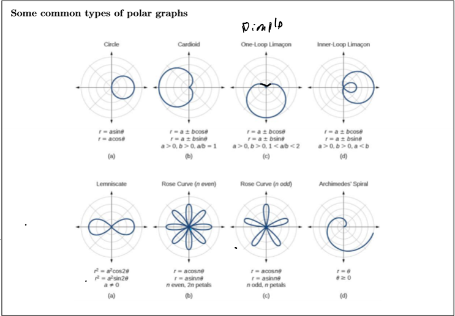

Vectors and Polar Coordinates
==============================

.. * Proofs

.. Areas to work on:

..     \frac{cot(x)sin^2(x)}{cos(2x)} &= \frac{tan(x)}{1-tan^2(x)} \\
..     \frac{cot(x)sin^2(x)}{1 - 2sin^2(x)} &= \frac{tan(x)}{1-tan^2(x)} \\
..     \frac{\frac{cos(x)}{sin(x)} sin^2(x)}{1 - 2sin^2(x)} &= \frac{tan(x)}{1-tan^2(x)} \\
..     \frac{cos(x) sin(x)}{1 - 2sin^2(x)} &= \frac{tan(x)}{1-tan^2(x)} \\
..     \frac{cos(x) sin(x)}{1 - 2sin^2(x)} &= \frac{ \frac{sin(x)}{cos(x)} }{1- \frac{sin^2(x)}{cos^2(x)}} \\
..     \frac{cos(x) sin(x)}{1 - 2sin^2(x)} &= \frac{ \frac{sin(x)}{cos(x)} }{ \frac{cos^2(x) - sin^2(x)}{cos^2(x)} } \\
..     \frac{cos(x) sin(x)}{1 - 2sin^2(x)} &= \frac{sin(x)}{cos(x)} \cdot \frac{cos^2(x)}{cos^2(x) - sin^2(x)} \\
..     \frac{cos(x) sin(x)}{1 - 2sin^2(x)} &= \frac{sin(x)}{cos(x)}{cos^2(x) - sin^2(x)} \\
..     \frac{cos(x) sin(x)}{1 - 2sin^2(x)} &= \frac{sin(x)}{cos(x)cos(2x)}

.. Conversions:

.. :math:`r=\sqrt{x^2+y^2}`
.. :math:`\theta=tan^{-1}(\frac{y}{x})`
.. :math:`x=r cos{\theta}`
.. :math:`y=r sin{\theta}`

.. #. Convert :math:`cos{\theta}` to :math:`\frac{x}{r}`
.. #. Eliminate r
.. #. 

Double Angle Identities
-------------------------

* :math:`sin(2\theta) = 2 sin(\theta) cos(\theta)`
* Cosine
    * :math:`cos(2\theta) = cos^2(\theta) - sin^2(\theta)`
    * :math:`cos(2\theta) = 1 - 2 sin^2(\theta)`
    * :math:`cos(2\theta) = 1 - 2 cos^2(\theta)`
* :math:`tan(2\theta) = \frac{sin(2\theta)}{cos(2\theta)} = \frac{2 tan(\theta)}{1 - tan^2(\theta)}`

.. rubric:: Proving Identities

Sum and Difference Identities
--------------------------------
Sum and difference formulas can be used to find angles not defined by the unit circle.

* Cosine
    * :math:`cos(A+B) = cos(A)cos(B) - sin(A)sin(B)`
    * :math:`cos(A-B) = cos(A)cos(B) + sin(A)sin(B)`
* Sine
    * :math:`sin(A+B) = sin(A)cos(B) + cos(A)sin(B)`
    * :math:`sin(A-B) = sin(A)cos(B) - cos(A)sin(B)`

.. tip::

    | Cosine == Contradiction
    | Sine == Similar

.. rubric:: Example

Find :math:`cos(105\deg)`

.. math::

    105 &= 60 + 45 \\
    cos(105) &= cos(60) \cdot cos(45) - sin(60) \cdot sin(45) \\
    cos(105) &= \frac{1}{2} \cdot \frac{\sqrt{2}}{2} - \frac{\sqrt{2}}{2} \cdot \frac{\sqrt{3}}{2} \\
    cos(105) &= \frac{\sqrt{2} - \sqrt{6}}{4} \\

Polar Coordinates
---------------------

.. rubric:: Important Terms

| A **pole** is a point on a polar coordinate system that represents the origin or center
| A **polar axis** is a ray originating the pole 

.. rubric:: Graphing a polar coordinate

Polar coordinates are written as :math:`(r, \theta)`. In order to graph, use the angle from the polar axis and go r rings. In r is negative, it will go backward.

.. drawio-image:: imgb2/polar-point.drawio

.. rubric:: Converting Polar to Cartesian

* :math:`x = r cos(\theta)`
* :math:`y = r sin (\theta)`

Example:

Convert :math:`(3, \frac{\pi}{6})` to Cartesian coordinates.

.. math::

    x &= 3 \cdot cos(\frac{\pi}{6}) \\
    x &= \frac{3 \sqrt{3}}{2} \\
    y &= 3 \cdot sin(\frac{\pi}{6}) \\
    y &= \frac{3}{2}

The solution is :math:`(\frac{3 \sqrt{3}}{2}, \frac{3}{2})`

.. rubric:: Converting Cartesian to Polar

* :math:`r = \sqrt{x^2+y^2}`
* :math:`\theta = tan^{-1}(\frac{y}{x})`

Example:

Convert :math:`(-3, -4)` to polar coordinates (radian)

First calculate values

.. math::

    r &= \sqrt{3^2 + 4^2} \\
    r &= 5 \\
    \theta &= tan^{-1}(\frac{4}{3}) \\
    \theta & \approx 0.927

Next determine the quadrant that the point is in and update everything to match. In this case, r can just be made negative.

Solution: :math:`(-5, 0.927)`

Polar Equations
------------------

Polar equations start with r=

A equation of r = k will result in a circle of radius k.

A normal polar equation will be :math:`r = \theta` or  :math:`r = sos(\theta)`

If a polar equation involves sin, it sits on the y-axis, with cosine makes it sit on the x-axis.

.. rubric:: Types of Graphs Seen

.. rubric:: Converting

To convert apply the same properties than converting points.

Example (Polar to Cartesian):

.. math::

    r &= 2sin(\theta) \\
    r &= 2 \frac{y}{r} \\
    r^2 &= 2y \\
    x^2+y^2 &= 2y

Example (Cartesian to Polar)

.. math::

    y &= x^2 \\
    r sin(\theta) &= r^2 cos^2(\theta) \\
    r &= \frac{sin(\theta)}{cos^2(\theta)}

Vectors
----------

| Vectors have a start point, magnitude, and direction
| Compleat form of vectors: :math:`\langle x,y \rangle`
| ij form: :math:`a i + b j` where i represent :math:`\langle 1,0 \rangle` and j shows  :math:`\langle 0,1 \rangle`

.. rubric:: Magnitude

    Use distance formula. Use notation :math:`||v||`

.. rubric:: Scalers

When multiplying a vector by one number, multiply all items.

:math:`5 \cdot \langle 2,5 \rangle = \langle 10,25 \rangle`

.. rubric:: Adding vectors

When adding vectors, add both values

:math:`\langle 3,4 \rangle \cdot \langle 2,5 \rangle = \langle 5, 9 \rangle`

.. note::

    Adding a number to a vector results in NaN

.. rubric:: Dot Product

Used when multiplying two vectors. Results in number.

* Simple way to calculate: :math:`\langle a,b \rangle \cdot \langle c,d \rangle = ac + bd`
* More complex way to calculate: :math:`\vec{a} * \vec{b} = ||a|| \cdot ||b|| \cdot cos(\theta)`
* Use the methods together when trying to find the angle between

The dot product provides information about the angle between two vectors.

If the dot product is positive, it is an acute angle. If it is negative it gives obtuse. If it is 0, they are orthogonal

