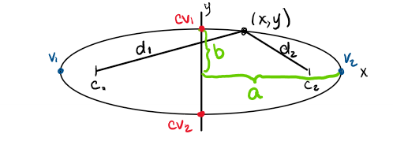
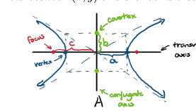
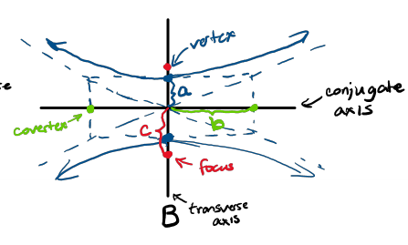
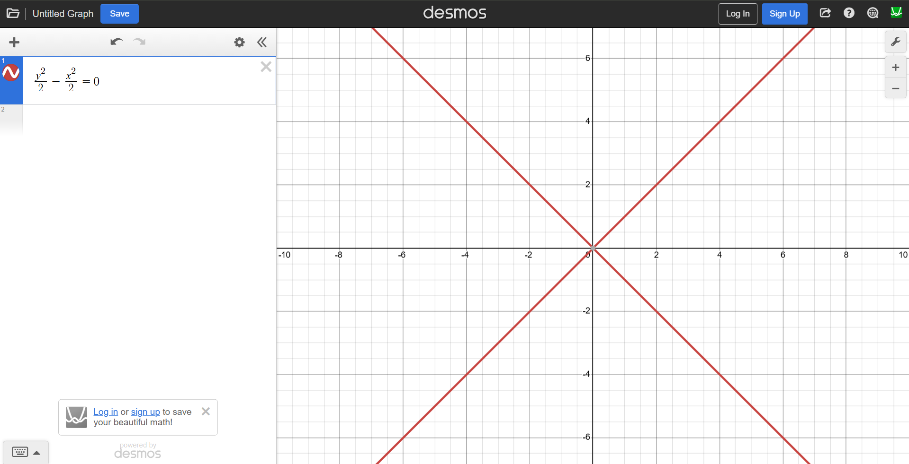
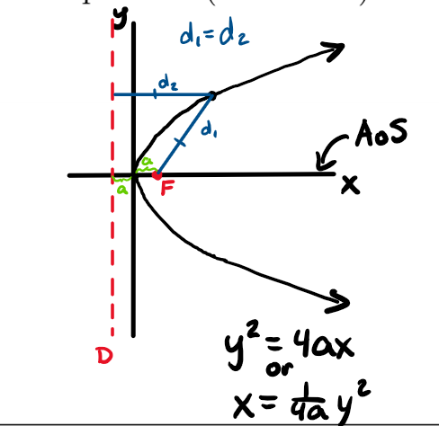

Conic Sections and Parametric Equations
=========================================

Parametric Equations
-----------------------

A parametric equation has a third variable t as the definition of time.

.. rubric:: Example

.. math::

    x = 5t \\
    y = t^3

x and y are both a function of t

.. rubric:: Removing t

t can be removed via substitution by isolating t.

.. math::

    x = 6t \\
    y = 3t^2 \\
    t = \frac{x}{6} \\
    y = 3 (\frac{x}{6})^2 \\
    y = \frac{3x^2}{36} 

.. rubric:: Adding t

t can be added via substitution by isolating a xy value

.. math::

    y = 4x^2 \\
    t = 3x \\
    x = \frac{t}{3} \\
    y = 4(\frac{t}{3})^2
    y = \frac{4t^2}{9}

Ellipses
----------

An ellipses follows the following equation:

.. math::

    \frac{(x - h)^2}{a^2} + \frac{(y - k)^2}{b^2} = 1

or

.. math::

    \frac{(y - k)^2}{a^2} + \frac{(x - h)^2}{b^2}  = 1

When the larger number is under the y, the graph is vertical. When the larger number is under x, it is horizontal.

.. note::

    The larger value will be the a while the smaller will be b

.. rubric:: c

Formula for c: :math:`c^2 = a^2 - b^2`

.. rubric:: Variables to Points

| Center: :math:`(h, k)`
| Vertices: :math:`(h \pm a, k)` or :math:`(h, k \pm a)` depending on direction
| Foci: :math:`(h \pm c, k)` or :math:`(h, k \pm c)` depending on direction (Matches Vertices Operations)
| Covertices: :math:`(h, k \pm b)` or :math:`(h \pm b, k)` depending on direction

.. rubric:: Horizontal Example

The following shows a graph of :math:`\frac{(x - h)^2}{a^2} + \frac{(y - k)^2}{b^2} = 1` where :math:`a > b`

.. rubric:: Circle

When :math:`a == b`, then it is a circle commonly written as:

.. math::

    (x - h)^2 + (y - k)^2 = r^2

.. rubric:: Degenerates

.. math::

    \frac{(x - h)^2}{a^2} + \frac{(y - k)^2}{b^2} = 1

The equation above produces a point at :math:`(h, k)`

.. math::

    \frac{(x - h)^2}{a^2} + \frac{(y - k)^2}{b^2} = -n

The equation above has no solution.

Hyperbolas
--------------

A hyperbola follows the following equation:

.. math::

    \frac{(x - h)^2}{a^2} - \frac{(y - k)^2}{b^2} = 1

or

.. math::

    \frac{(y - k)^2}{a^2} + \frac{(x - h)^2}{b^2}  = 1

.. rubric:: Asymptotes   

.. math::

    y - k = \pm \frac{under y}{under x} (x - h)

.. rubric:: c

Formula for c: :math:`c^2 = a^2 + b^2`

.. rubric:: Variables to Points

| Center: :math:`(h, k)`
| Vertices: :math:`(h \pm a, k)` or :math:`(h, k \pm a)` depending on direction
| Foci: :math:`(h \pm c, k)` or :math:`(h, k \pm c)` depending on direction (Matches Vertices Operations)
| Covertices: :math:`(h, k \pm b)` or :math:`(h \pm b, k)` depending on direction

.. rubric:: Horizontal Example

The following shows a graph of :math:`\frac{(x - h)^2}{a^2} - \frac{(y - k)^2}{b^2} = 1`

.. rubric:: Vertical Example

The following shows a graph of :math:`\frac{(y - k)^2}{a^2} + \frac{(x - h)^2}{b^2}  = 1`

.. rubric:: Degenerates

.. math::

    \frac{(x - h)^2}{a^2} - \frac{(y - k)^2}{b^2} = 0

Results in only the asymptote lines

Parabolas 
----------

A parabola follows the following equation:

.. math::

    (x - h)^2 = 4a(y - k)

or

.. math::

    (y - h)^2 = 4a(x - k)

.. rubric:: Variables to Graph

| Vertex: :math:`(h, k)`
| Focus:  :math:`(h, k + a)` or :math:`(h + a, k)` depending on direction
| Directrix: :math:`y = -a` or :math:`x = -a`  depending on direction

.. rubric:: Horizontal Example

.. rubric:: Vertical Example

